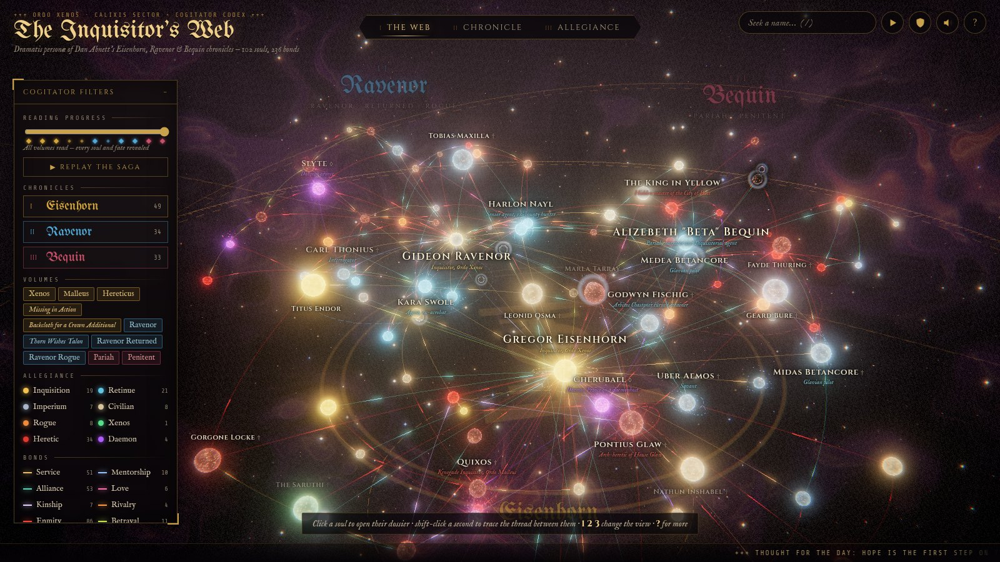
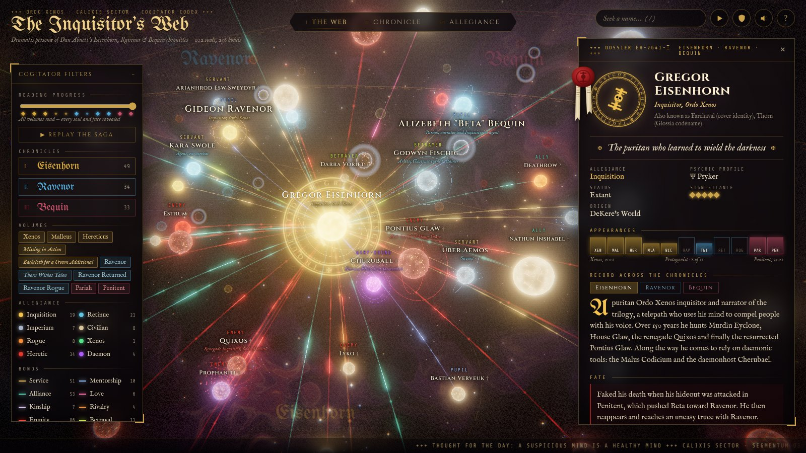
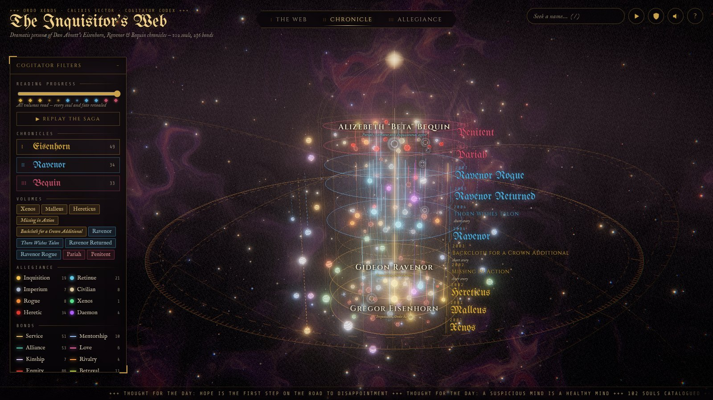
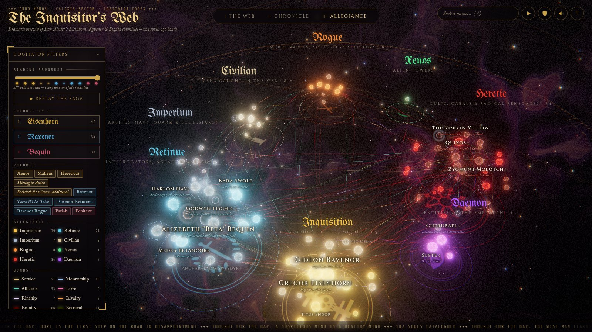
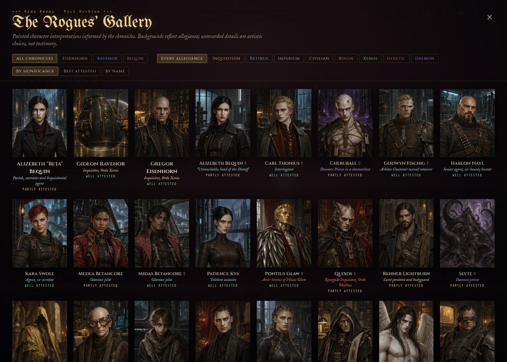
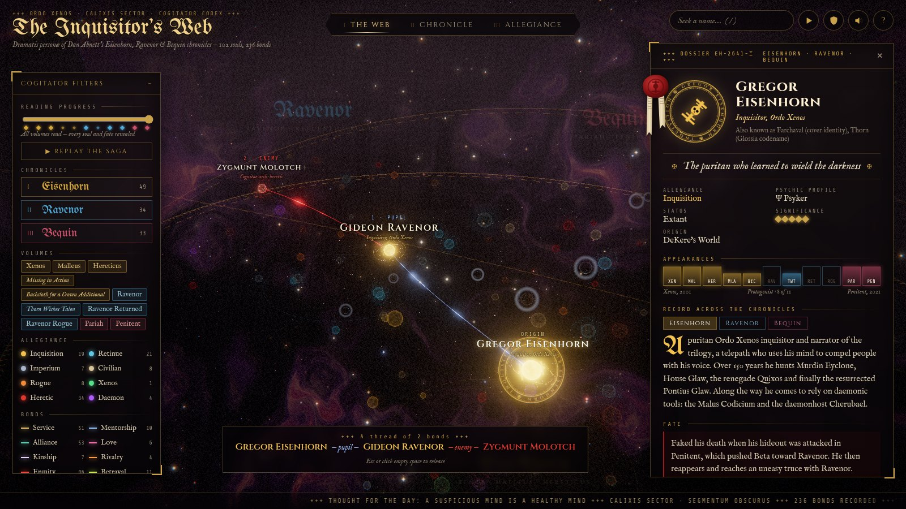

# The Inquisitor's Web

An interactive three.js codex of the characters in Dan Abnett's **Eisenhorn** omnibus (*Xenos*, *Malleus*,
*Hereticus*, *Missing in Action*, *Backcloth for a Crown Additional*), **Ravenor** omnibus (*Ravenor*,
*Thorn Wishes Talon*, *Ravenor Returned*, *Ravenor Rogue*), and the Bequin novels **Pariah** and **Penitent**.

102 characters, 236 relationships, 11 volumes and 46 worlds.



## Running it

```sh
nix develop          # or: direnv allow   (provides node 22 + pnpm)
pnpm install
pnpm dev             # http://127.0.0.1:5173
pnpm build           # static site in dist/ (relative paths, host anywhere)
```

Useful URL options:

| Option | Effect |
| --- | --- |
| `?nointro` | Skip the opening transmission |
| `#gregor-eisenhorn` | Open straight to a character's dossier (any id from the codex) |
| `?hq` | Turn off adaptive resolution (useful for screenshots) |

## The three views

| | |
| --- | --- |
| **I · The Web**: a 3D force-directed graph. Each character is pulled toward the chronicle(s) they belong to, so those who appear in all three series (Eisenhorn, Ravenor, Cherubael, Nayl, Swole, Medea) end up at the centre. Bonds are drawn as arcs whose pulses flow from master to servant, mentor to pupil, and betrayer to betrayed. |  |
| **II · Chronicle**: the eleven volumes stacked as rings in publication order inside a gilded spire. Each character sits on the ring of their first appearance, and a lifeline rises through every later book they return in (dim where they're absent). The 46 worlds, ships and places orbit outside the spire; hover one for its record, or click it for the books it appears in. Click a book's title to open its card: synopsis, the worlds it visits, and its cast. |  |
| **III · Allegiance**: the cast grouped by allegiance (Inquisition, retinues, Imperium, civilians, rogues, xenos, heretics and daemons), with the most important characters at the centre of each group. |  |

## Likenesses

All 102 characters have painted portraits generated with ChatGPT Images, replacing the procedural SVGs in the app.
A separate research pass
collected each character's attested physical traits, with evidence (`research/appearance/*.json`): form, age, build,
skin, hair, eyes, scars and augmetics, clothing and carried items. `scripts/merge-appearance.mjs` validates these
against a fixed vocabulary and writes `src/data/appearance.json`.

- `src/ui/likeness-img.ts` selects approved WebP portraits and thumbnails from `src/data/portraits.json`. The original
  SVG renderer remains only as a fallback for missing assets; every current character has a painted asset.
- The Beta Bequin portrait establishes the painted style shared across the archive.
  Backgrounds vary with allegiance and role: gold Inquisition rooms, cyan retinue workspaces, steel-blue Imperial
  locations, red heretic settings, violet daemon spaces, jade xenos architecture, rust-orange rogue locations and
  warm civilian interiors.
- **These are artistic interpretations, not canonical artwork.** The sourced *Likeness* evidence remains separate.
  Unrecorded details, typical role clothing and environmental settings are creative choices. Unseen characters
  such as the King in Yellow and Lilean Chase receive anonymous or symbolic depictions.
- Portraits appear in the dossier, with a *Likeness* section listing each trait and the source behind it, and in
  hover cards. In 3D they become medallions on each soul as you get close or select it. The **Pict Archive**
  (`G`, or the arch icon) shows every likeness on one wall, filterable and sortable by how well attested it is.
  Click a dossier portrait to open the enlarged pict viewer; `Esc` closes it without closing the dossier.

Original PNGs and exact prompts are retained under `docs/portraits/`; only optimized 800×1000 WebPs and
240×300 thumbnails are served from `public/portraits/`. [Complete asset and prompt index](docs/portraits/all-chatgpt.md).
To republish approved sources:

```sh
nix shell nixpkgs#nodejs_22 nixpkgs#imagemagick --command node scripts/publish-portraits.mjs
nix develop --command node scripts/check-portraits.mjs
```



## Things to try

- **Click** a character to open their dossier: a wax-sealed record with an emblem, epithet, psychic profile, appearances across all
  11 volumes, a record of their part in each chronicle, their fate, wargear and known associates. Hovering an
  associate highlights them in the scene.
- **Shift-click** a second character to *trace the thread*: the shortest chain of bonds between the two,
  e.g. Eisenhorn *(pupil)* Ravenor *(enemy)* Molotch.

  

- **Reading progress** is asked on the opening screen and can be changed later in the filters panel: set the last book you've finished. Characters you haven't met yet disappear, and fates
  that continue past that point are blurred (click to reveal). Arcs from chronicles you haven't reached stay hidden,
  and lifelines stop at your bookmark. The **Spoiler Ward** button (shield) blurs every fate.
- **Tour** (▶): a guided camera tour of the principal characters.
- **Sound** (speaker icon): a generative cathedral ambience built entirely with WebAudio (an organ drone, a formant
  choir and struck bells). There are no samples.
- Filters for chronicle, volume, allegiance, bond type and significance. Shift-click any filter to isolate it.

The search box also answers to at least one phrase of Glossia, the private cant of Eisenhorn's circle.

Keyboard: `1` `2` `3` switch views · `/` search · `T` tour · `S` spoiler ward · `M` sound · `F` filters ·
`←`/`→` step to an associate · `Esc` release · `Home` recentre (or double-click empty space).

### Visual language

| Sign | Meaning |
| --- | --- |
| Colour | Allegiance (gold Inquisition, cyan retinue, steel Imperium, red heretic, violet daemon…) |
| Size and orbiting rings | Significance: two rings for principal characters, three for the protagonists |
| Orbiting motes | Psyker |
| A black hole with a cold rim | Untouchable / blank (Alizebeth Bequin, Beta, Frauka…) |
| Rising embers and a boiling core | Daemon |
| Ash-grey core with glowing cracks | Deceased (hidden while the spoiler ward is up) |

## How it's built

- **three.js** with an `EffectComposer` chain: render, Unreal bloom, then a custom grade pass (vignette, grain,
  chromatic fringe and a "warp shudder" during transitions).
- The **backdrop** is a full-sphere fbm-noise nebula shader that churns harder when a daemon is selected, plus a
  twinkling star field, drifting embers and a slowly turning brass astrolabe.
- **Characters** are icosphere cores with a fresnel/noise shader, additive halos, GPU-animated spark systems for
  psykers and daemons, and "void" halos for blanks.
- **Bonds** are quadratic arcs in a single `LineSegments` buffer with a flowing-pulse shader. Highlighted bonds also
  get tube meshes and travelling sparks. Arcs are only re-tessellated when an endpoint moves.
- **Labels** use `CSS2DRenderer`, with a greedy screen-space declutter so higher-priority names win and labels keep
  clear of the HUD panels and chronicle titles.
- The **Web layout** is a deterministic (seeded) 3D force simulation computed at start-up. Switching views
  animates every node along a slightly bowed path.
- The camera's view offset slides the scene's focal point into whatever space the panels leave free.
- Resolution adapts automatically if the frame rate drops below ~40 fps.

### Data

Character data was researched from the Warhammer 40k Fandom wiki, Lexicanum (via archived copies), TV Tropes,
and published reviews and synopses. Each dossier links its sources. The pipeline:

```
research/eisenhorn.json ─┐
research/ravenor.json   ─┼─ scripts/merge.mjs ──> src/data/codex.json
research/bequin.json    ─┤    (merges characters across series, keeps per-series arcs,
research/curation.json  ─┘     applies hand corrections, validates relations)
```

Run `node scripts/merge.mjs` after editing any research file. A separate fact-check pass (`research/audit.md`) cross-checked every character of importance 3 and above against the sources, and its corrections are applied through the curation file. `research/curation.json` holds the manual fixes:
merging duplicate ids (e.g. Lord Rorken), correcting the direction of mentor bonds, faction fixes, and so on.

`scripts/cdp.mjs` is a small dependency-free Chrome DevTools Protocol driver used for visual QA. It runs headless
Chromium with SwiftShader WebGL and takes scripted screenshots.

---

*A non-commercial fan work. Warhammer 40,000, the Inquisition and all associated characters are © Games Workshop;
the novels are by Dan Abnett and published by Black Library. Fonts: Cinzel, Cinzel Decorative, IM Fell English,
UnifrakturMaguntia, and Share Tech Mono (SIL OFL).*
