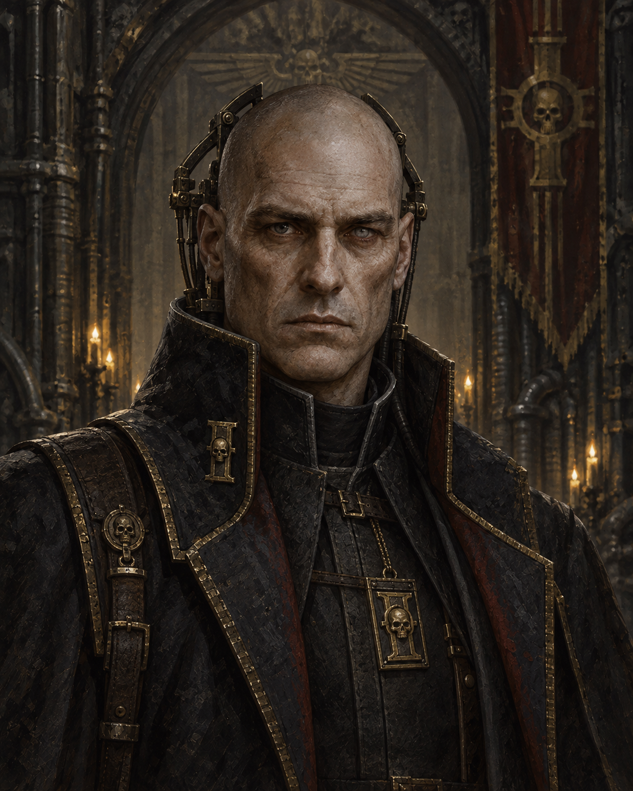
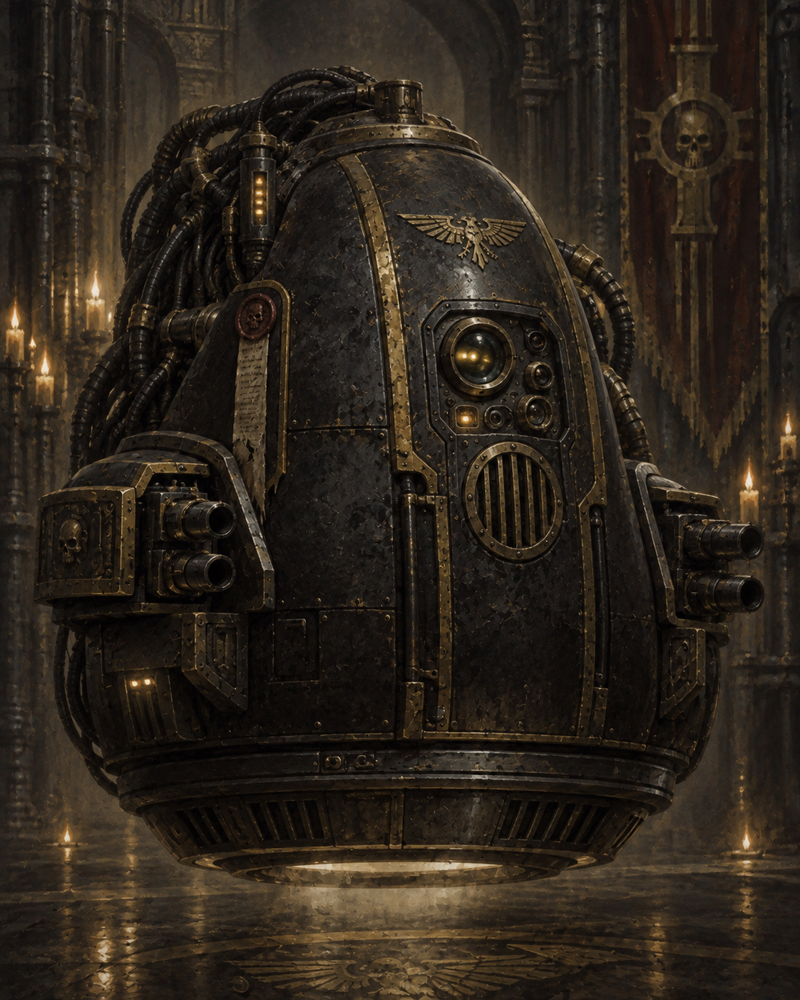
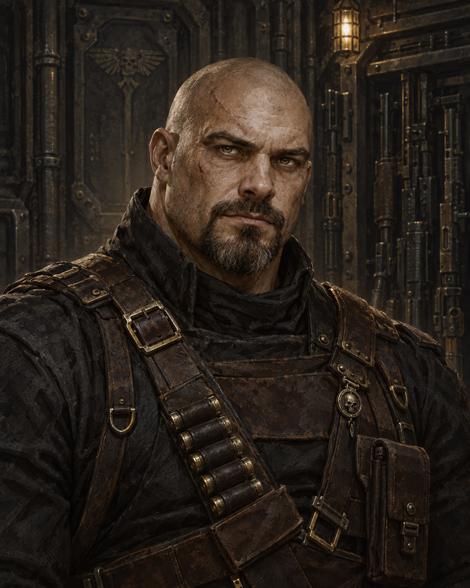
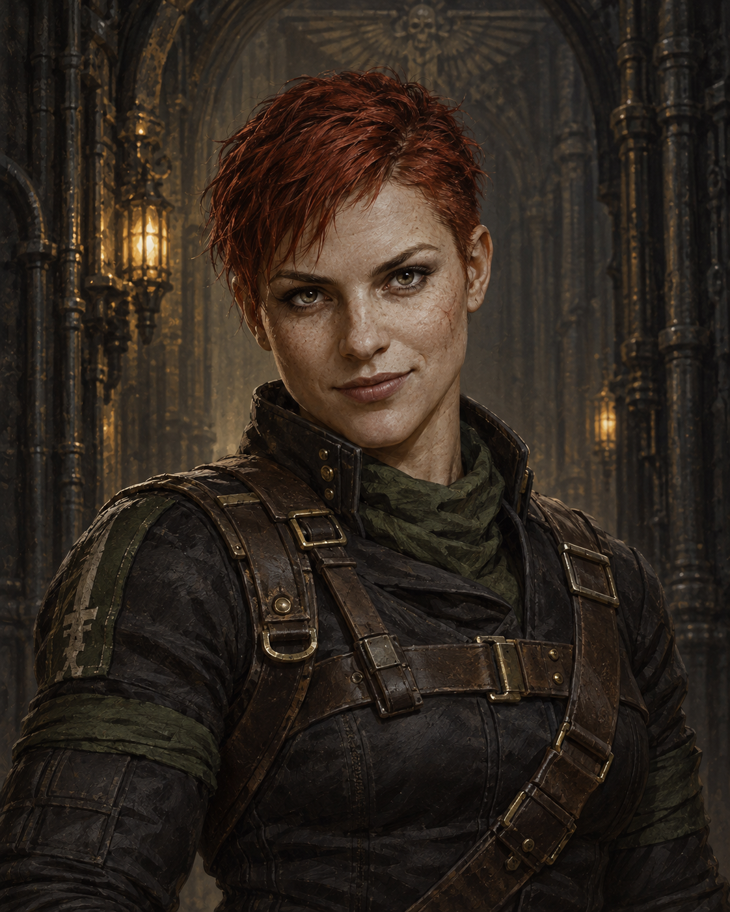
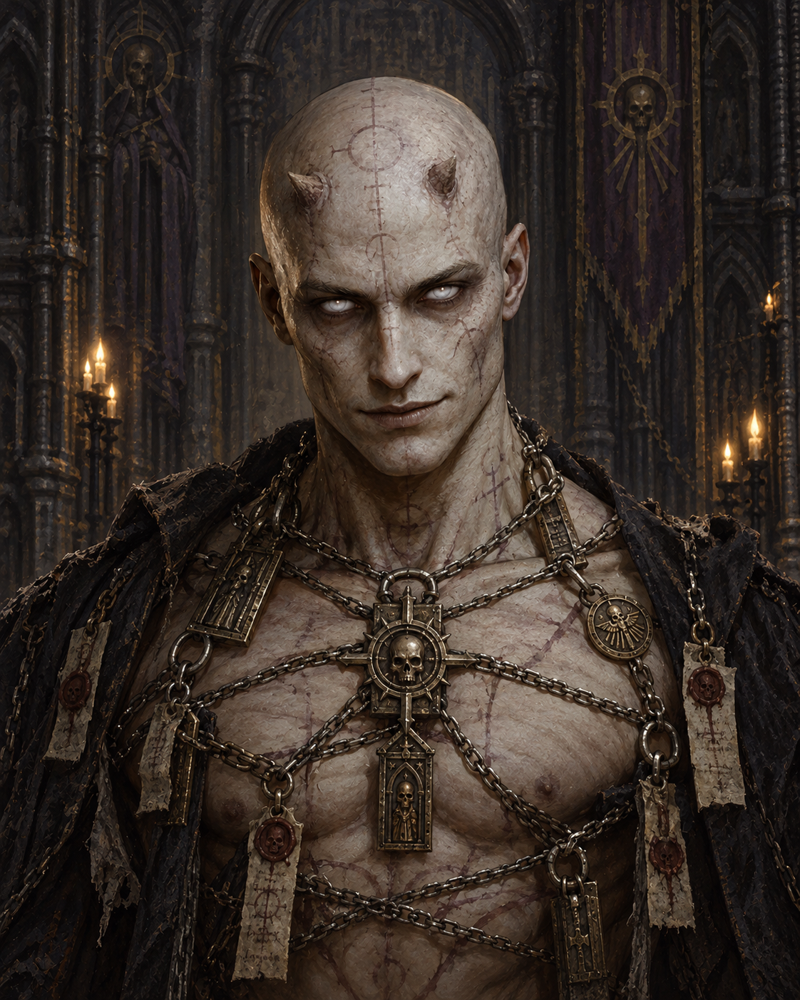
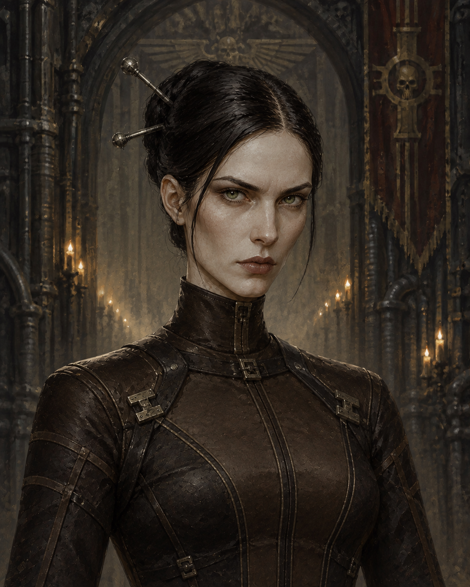
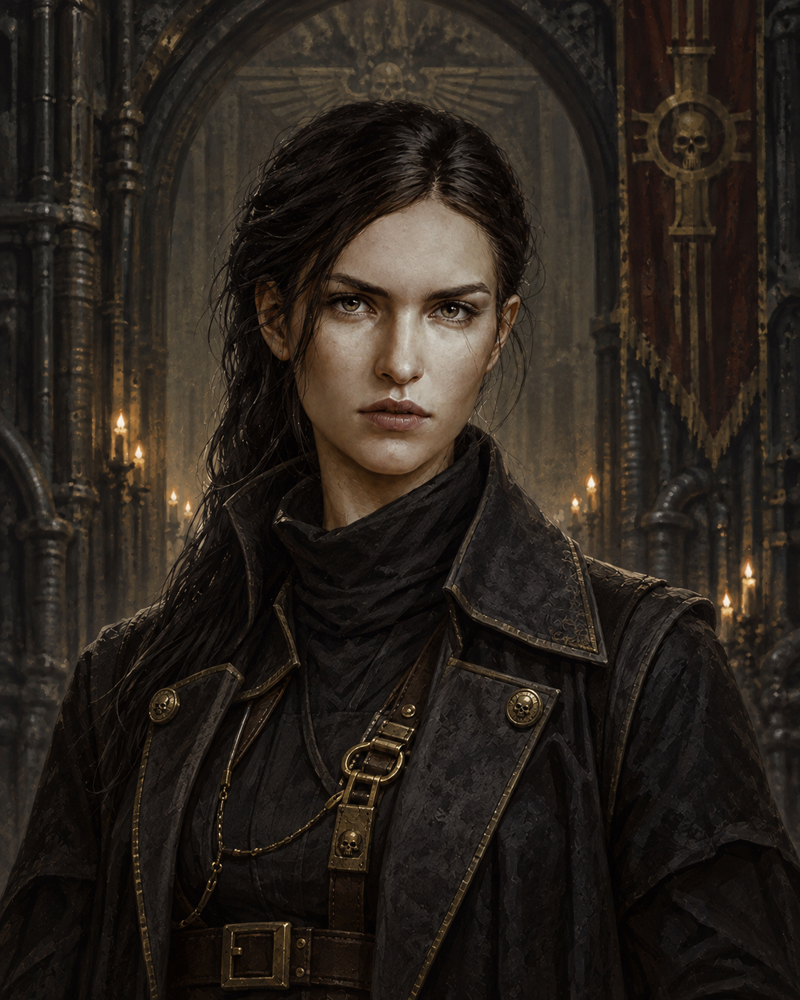
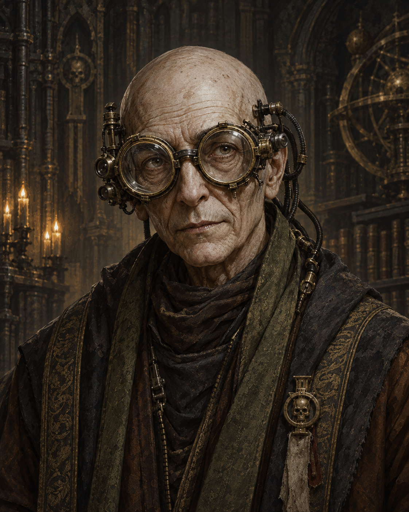
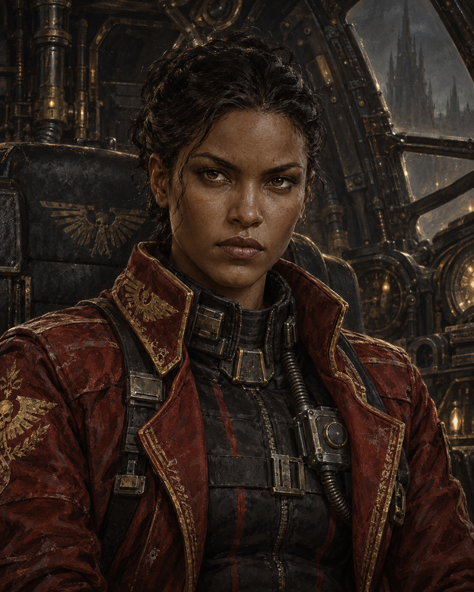
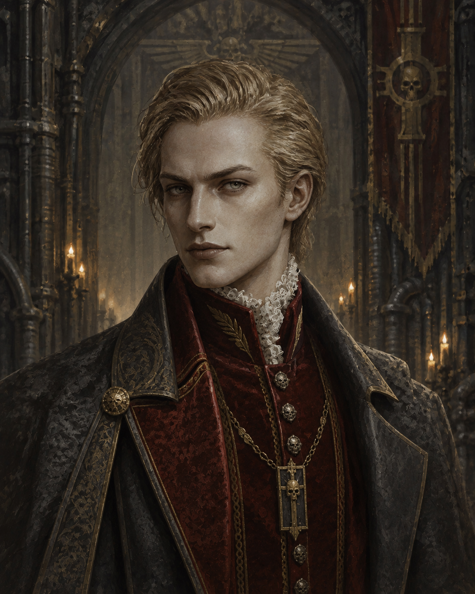

# Top ten other characters — ChatGPT Images

Ten new individual portraits generated with the built-in ChatGPT Images tool, all using Beta Bequin's portrait as the master style reference.

## Selection

The existing Beta portrait is excluded. Characters are ranked using `src/data/codex.json`: descending importance, then book count, then relationship count, then name. This is a project-data ranking, not a claim about a universal popularity ranking.

## Deliverables

All selected PNGs are 1122 x 1402. Exact prompts are linked alongside each portrait. [Machine-readable manifest](top-10-chatgpt.json).

| Rank | Character | Portrait | Exact prompt |
| --- | --- | --- | --- |
| 1 | Gregor Eisenhorn | [PNG](../../docs/portraits/sources/gregor-eisenhorn.chatgpt.png) | [Prompt](gregor-eisenhorn-chatgpt.prompt.txt) |
| 2 | Gideon Ravenor | [PNG](../../docs/portraits/sources/gideon-ravenor.chatgpt-v2.png) | [Prompt](gideon-ravenor-chatgpt-v2.prompt.txt) |
| 3 | Harlon Nayl | [PNG](../../docs/portraits/sources/harlon-nayl.chatgpt.png) | [Prompt](harlon-nayl-chatgpt.prompt.txt) |
| 4 | Kara Swole | [PNG](../../docs/portraits/sources/kara-swole.chatgpt.png) | [Prompt](kara-swole-chatgpt.prompt.txt) |
| 5 | Cherubael | [PNG](../../docs/portraits/sources/cherubael.chatgpt.png) | [Prompt](cherubael-chatgpt.prompt.txt) |
| 6 | Patience Kys | [PNG](../../docs/portraits/sources/patience-kys.chatgpt.png) | [Prompt](patience-kys-chatgpt.prompt.txt) |
| 7 | Alizebeth Bequin | [PNG](../../docs/portraits/sources/alizebeth-bequin.chatgpt.png) | [Prompt](alizebeth-bequin-chatgpt.prompt.txt) |
| 8 | Uber Aemos | [PNG](../../docs/portraits/sources/uber-aemos.chatgpt.png) | [Prompt](uber-aemos-chatgpt.prompt.txt) |
| 9 | Medea Betancore | [PNG](../../docs/portraits/sources/medea-betancore.chatgpt.png) | [Prompt](medea-betancore-chatgpt.prompt.txt) |
| 10 | Carl Thonius | [PNG](../../docs/portraits/sources/carl-thonius.chatgpt.png) | [Prompt](carl-thonius-chatgpt.prompt.txt) |

Ravenor's selected portrait is the second version: a continuous enclosed hovering force-chair silhouette rather than the humanoid-looking first attempt. The first attempt and its prompt remain available separately for comparison.

## Visual and research notes

All ten images retain the painterly lighting, muted charcoal and antique-gold materials of the Beta reference. Clothes, facial features, machinery and backgrounds remain artistic interpretations rather than authoritative canonical artwork. Medea's swept-back dark hair is an explicit artistic choice where the checked description does not establish hair colour.

Character context came from the current codex and its archived research under `research/raw`, `research/raw_ravenor` and `research/raw_bequin`. Supplementary appearance checks included:

- [Black Library's Hereticus extract](https://www.blacklibrary.com/downloads/product/pdf/h/hereticus.pdf): Kara's short red hair and compact muscular build.
- [Harlon Nayl, Lexicanum](https://wh40k.lexicanum.com/mediawiki/index.php?mobileaction=toggle_view_desktop&title=Harlon_Nayl) and [German entry](https://wh40k-de.lexicanum.com/mediawiki/index.php?mobileaction=toggle_view_mobile&title=Harlon_Nayl): shaved head, large build, goatee.
- [Medea Betancore, German Lexicanum](https://wh40k-de.lexicanum.com/wiki/Medea_Betancore): dark Glavian skin and inherited red-and-gold flight jacket.
- [Ravenor omnibus excerpt surfaced by search](https://metallicman.com/wp-content/uploads/asgarosforum/6117/Ravenor-omnibus-by-Abnett-Dan-converted.pdf): Kys's hair, eyes and clothing; Thonius's blond hair and tailored clothes. No novel text is reproduced in these deliverables.
- [Cherubael, Lexicanum](https://wh40k.lexicanum.com/wiki/Cherubael) and [daemonhost description](https://scifi.stackexchange.com/questions/38761/who-did-gregor-bind-cherubael-to): a bound human host with altered eyes and small horns.

## Scope

These are separately saved portrait assets for evaluation. This batch does not change application code, replace existing assets, publish the site, or create a commit.

## Portrait gallery

### 1. Gregor Eisenhorn

### 2. Gideon Ravenor

### 3. Harlon Nayl

### 4. Kara Swole

### 5. Cherubael

### 6. Patience Kys

### 7. Alizebeth Bequin

### 8. Uber Aemos

### 9. Medea Betancore

### 10. Carl Thonius

